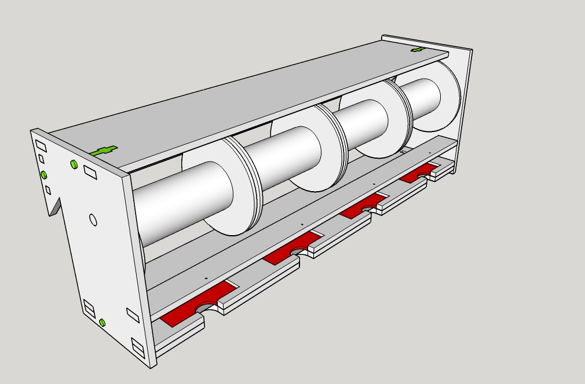

# Kabelrollenhalter

Die Geschichte des Kabelrollenhalter musste mal wieder neu geschrieben werden. Ein Projekt für den Lasercutter und den 3D-Drucker. Passend für Kabelrollen mit 75 mm Breite und 65 mm Durchmesser.

Die Breite des Halters ist 318 mm, Tiefe 83 mm und die Höhe 107 mm.

  

Benötigt wird eine Sperrholzplatte 280 x 420 x 4 mm (3,6mm funktionieren auch) , 4 Rasierklingen eckig 42 x 22 mm, 6 x Schrauben M4/20, 6 x Muttern M4 und eine Stange 6 mm. Hierfür kann man eine Gewindestange mit 2 Muttern verwenden oder ein Alurohr 6mm das innerhalb der Seitenteile mit einem Gummiring gegen verrutschen gesichert wird. Wenn man eine Gewindestange verwendet, kann man zwei Muttern innen zur Verschraubung verwenden. Zwischen den Kabelrollen verbleiben ca. 20 mm.  

Die Spitze an der Rückseite ist für unser Aufhängesystem im [erfindergarden](http://www.erfindergarden.de)

# Design

Mit **SketUp** gezeichnet. Exportiert als DXF. In **Inkscape** importiert und zu einer SVG umgewandelt. 

Um aus der von SketchUp gelieferten DXF Datei mit lauter einzelnen Pfaden eine brauchbare Laservorlage zu bekommen muss folgendes  in Inkscape unternommen werden.

 

- Alle Pfade eines Bauteils markieren. 
- Pfade kombinieren
- mit gedrückter Strg.Taste und dem Knotenwerkzeug alle Knoten markieren.
- "Knoten verbinden" Button drücken

Viel Spaß beim Nachbauen.

